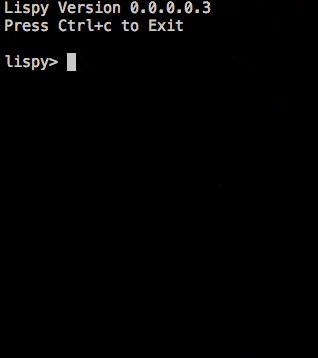

# lispy

http://www.buildyourownlisp.com/



## Usage

Run `./bin/evaluation`.

## Examples

```
Lispy Version 0.0.0.0.3
Press Ctrl+c to Exit

lispy> + 5 6
11
lispy> - (* 10 10) (+ 1 1 1)
97
lispy> - 3
-3
lispy> % 10 6
4
lispy> ^ 4 2
16
lispy> min 1 5 3
1
lispy> max 1 5 3
5
```

## Development

* `make`
* `make test`
* `make clean`
* `make distclean`
